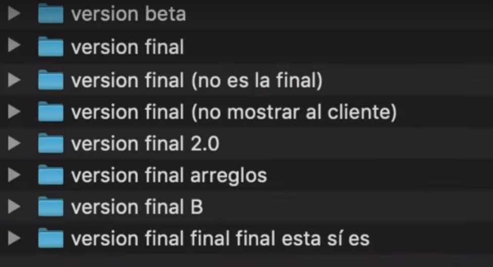
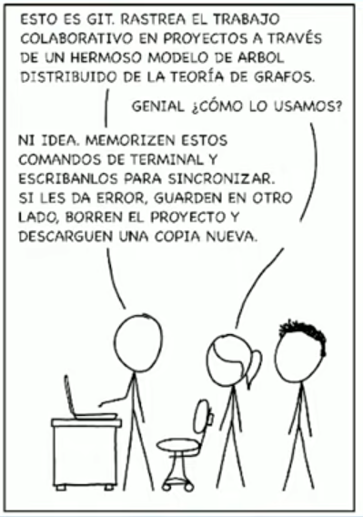
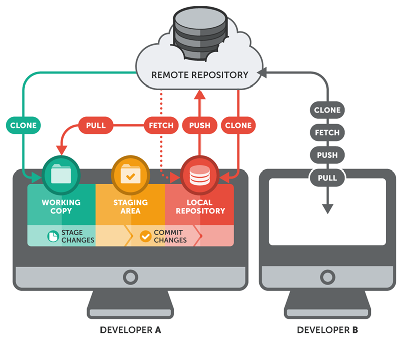
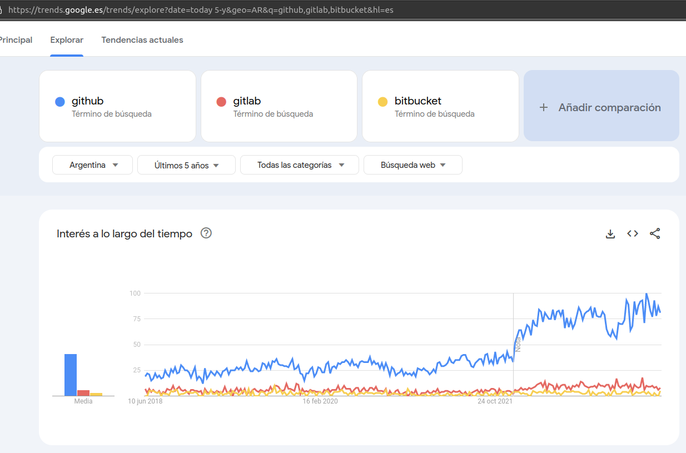
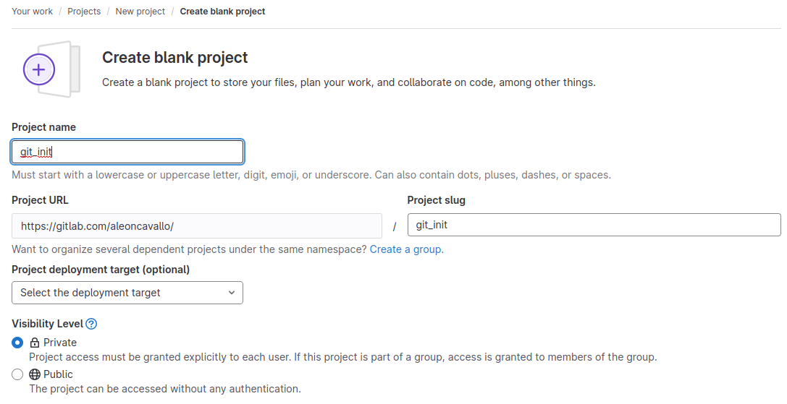
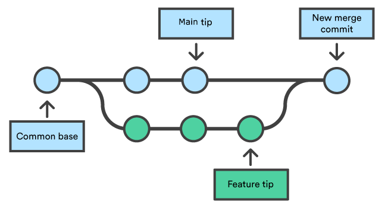

% Entorno de Programación - Introducción a scm y git
% Tecnicatura Universitaria en Inteligencia Artificial
% U.N.R.

## Introducción a git

. . . 

* Sistema de control de versiones (SCM). https://git-scm.com/ 

. . .

* Esencialmente, rastrea los cambios de nuestros archivos, 

. . .

				y permite ir hacia atrás si hace falta.

## Nuestra motivación a esta altura

vamos a tratar de evitar esto

{width=70%}

## Introducción a git

* Creado originalmente por Linus Torvalds en 2005...

. . .

                                                          en semanas.

. . .

{width=30%}


## Flexible, jerárquico, distribuido


{width=70%}


## Introducción a git


* Programado en: C, Bourne Shell, Perl

. . .

* Es un proyecto de código abierto

. . .

* Una de sus principales caracteristicas es que es distribuido.

. . . 

* Cada desarrollador tiene todo el código y toda la historia.  

## Aprender entender y usar apropiadamente git 

{width=30%}


## ¿Cómo arranca un repositorio?

1. clonando:
```bash
$ git clone https://github.com/aleoncavallo/tutorial_bash
```

. . .

```bash
Clonando en 'tutorial_bash'...
remote: Enumerating objects: 186, done.
remote: Counting objects: 100% (35/35), done.
remote: Compressing objects: 100% (31/31), done.
remote: Total 186 (delta 18), reused 10 (delta 4), pack-reused 151
Recibiendo objetos: 100% (186/186), 821.02 KiB | 5.20 MiB/s, listo.
Resolviendo deltas: 100% (64/64), listo.
```

## ¿Cómo arranca un repositorio?

2. inicializando:

. . .

```bash
~/$ git init proyecto
```

. . .

```bash
Inicializado repositorio Git vacío en /home/aleoncavallo/proyecto/.git/
```

. . .

```bash
~$ cd proyecto/
```


## Mirando el estado


```bash
~/tutorial_bash$ git status
```

. . . 

```bash
En la rama master
Tu rama está actualizada con 'origin/master'.

nada para hacer commit, el árbol de trabajo está limpio
```

## Mirando el estado

```bash
~/proyecto$ touch otro.sh
```

. . .

```bash
~/proyecto$ echo 'echo hola mundo!' > script.sh
```

. . . 

```bash
~/proyecto$ git status
```

. . .

```bash
En la rama master
Tu rama está actualizada con 'origin/master'.

Archivos sin seguimiento:
  (usa "git add <archivo>..." para incluirlo a lo que se será confirmado)
	otro.sh
	script.sh

no hay nada agregado al commit pero hay archivos sin seguimiento presentes 
  (usa "git add" para hacerles seguimiento)
```

## Estados de un archivo


{width=90%}


## Stagin area (escenario)

```bash
~/proyecto$ git add script.sh
```

. . . 


```bash
~/proyecto$ git status
```

. . . 

```bash
En la rama master
Tu rama está actualizada con 'origin/master'.

Cambios a ser confirmados:
  (usa "git restore --staged <archivo>..." para sacar del área de stage)
	nuevos archivos: script.sh
Archivos sin seguimiento:
  (usa "git add <archivo>..." para incluirlo a lo que se será confirmado)
	otro.sh

```


## Estados repositorio


{width=80%}


## Commit (compromiso)

```bash
~/proyecto$ git commit -m "Inicio proyecto"
```

. . . 

```bash
[master (commit-raíz) 4ac0385] Inicio proyecto
 1 file changed, 1 insertion(+)
 create mode 100644 script.sh
```

. . . 

```bash
~/proyecto$ git status
```

. . . 

```bash
En la rama master
Archivos sin seguimiento:
  (usa "git add <archivo>..." para incluirlo a lo que se será confirmado)
	otro.sh

no hay nada agregado al commit pero hay archivos sin seguimiento presentes 
  (usa "git add" para hacerles seguimiento)
```


## Commit (compromiso)

* Es una fotografía de una situación de nuestro código/proyecto 
Se puede pensar como la foto completa del árbol de los estados hasta el momento

.  .  . 

* Es un hash criptográfico de:
  * Todos los archivos
  * Mensaje de commit
  * Autor, fecha, etc
  * Commit padre

.  .  . 

Hash criptográfico = es in identificador, se hace con una operación matemática que no se puede invertir, es muy dificil encontrar colisiones
Lo calculan con optimizaciones para no computar el hash desde cero cada vez 


## Log 

```bash
~/proyecto$ git log -p
```

. . .

```bash
commit 4ac03851baed8e79c19ba3c2e3707d0f8477abc8 (HEAD -> master)
Author: Andrea Leon Cavallo <aleoncavallo@gmail.com>
Date:   Tue May 30 17:16:28 2023 -0300

    Inicio proyecto

diff --git a/script.sh b/script.sh
new file mode 100644
index 0000000..34cae35
--- /dev/null
+++ b/script.sh
@@ -0,0 +1 @@
+echo hola mundo!
```

## Diff Unificado

```bash
~/proyecto$ git show
```

```bash
commit 06031abc6fd5794e7b5e1bc6b941d0d3984408df (HEAD -> master)
Author: Andrea Leon Cavallo <aleoncavallo@gmail.com>
Date:   Tue May 30 17:26:00 2023 -0300

    corregir enfasis en español

diff --git a/script.sh b/script.sh
index 34cae35..baaa505 100644
--- a/script.sh
+++ b/script.sh
@@ -1 +1 @@
-echo hola mundo!
+echo ¡hola mundo!

```

## Borrar archivos

* `git rm` borra un archivo (y anota el cambio en la staging area). Es lo
mismo que hacer `rm` y `git add`.

```bash
~/proyecto$ git rm script.sh
```

. . .

```bash
rm 'script.sh'
```

. . .

```bash
~/proyecto$ git status
```

. . . 

```bash
On branch master
Your branch is up to date with 'origin/master'.
Changes to be committed:
(use "git restore --staged <file>..." to unstage)
deleted:
script.sh
```

. . .

```bash
$ git commit -m "Borrar main"
```

. . .

```bash
[master f068e5f] Borrar main
1 file changed, 1 deletions(-)
delete mode 100644 main.c
```


## Buenas prácticas

* Commits lo más pequeños posibles (“atómicos”): permite revertir fácilmente

. . .

* Mensajes descriptivos: “cambios” vs “Agrego tal funcionalidad”


## Config

```bash
### Establecer el nombre de usuario y email
$ git config --global user.name "Alan Turing"
$ git config --global user.email "aturing@princeton.edu"
```

```bash
### Guardar la clave y no la pregunte continuamente
$ git config --global credential.helper store
```

. . .

El --global es solo si lo estan usando en un equipo que no comparten con otros y que no usan para otro servidor de git. 


## Remotes

Hasta ahora, nada requirió internet.

. . .

De ahí viene lo de distribuido, 
todos los cambios que fuimos haciendo y registrando 
los podemos hacer sin conexión a internet/red.

## Remotes

GitLab y GitHub, y Bitbucket son sitios que ofrecen la posibilidad de alojar en ellas nuestros proyectos.

{width=50%}


## Remotes

{width=90%}

## Remotes

{width=90%}

## Remotes

{width=90%}

## Remotes

{width=90%}

## Remotes

{width=60%}

## Remotes

{width=60%}

## Remotes

{width=90%}

## Remotes


```bash
git remote add origin https://github.com/aleoncavallo/git_intro.git
```

. . . 

o desde gitlab

```bash
git remote add origin git@gitlab.com:aleoncavallo/git_init.git
```


## Push/pull
* Push: actualiza el repo remoto desde el local (sólo cambios commiteados)
* Pull: actualiza el repo local desde el remote


## 

Lo más básico ya está


## Revirtiendo cambios
* `git checkout <file>`: revierte cambios locales.
* `git reset`: vacía el staging area.
* `git reset <commit>`: vuelve al commit, sin modificar archivos.
* `git reset --hard \<commit>`: vuelve al commit, descartando todo.


## Branches (Ramas)
* Un branch es un nombre que “apunta” o “sigue” a un commit hash
* `git branch caracteriasticaX`: crear y moverse a un branch
* `git checkout <b>`: cambiar de branch
* master suele ser la rama principal


## Merge (Unir ramas)
* Toma dos commits y une sus cambios en uno.

. . .

* En branch source `git merge <commit>`.

. . .


Pull tiene merge implícito, push sólo permite “fast-forwards”.

. . .


{width=60%}

. . .

Posiblemente haya que corregir conflictos


## Rebase

* Similar a un merge... pero “reescribe la historia”

{width=60%}

* Generalmente sólo se hace en ramas privadas


## Bisect

`git bisect` 
 Bisect es partir por la mitad y es justamente lo que va a hacer este comando,
 ir dividiendo toda la pila de commits en dos partes, 
 una parte de la pila contendrá el error y otra parte no.


## Clean

Usar con mucho cuidado...

* `git clean -dfx`: borra todo lo que no esté trackeado/staged
* `git clean -x`: borra sólo archivos ignorados (suele ser seguro)
* Flag -n: no hacer nada, imprimir lo que haría


## Fuentes y links recomendados

* Sitio oficial de git: https://git-scm.com/

* Guía de git:  https://rogerdudler.github.io/git-guide/

* Aprender a hacer reamas: https://learngitbranching.js.org/?locale=es_AR

* Video Aprende GIT de HolaMudo https://www.youtube.com/watch?v=VdGzPZ31ts8

